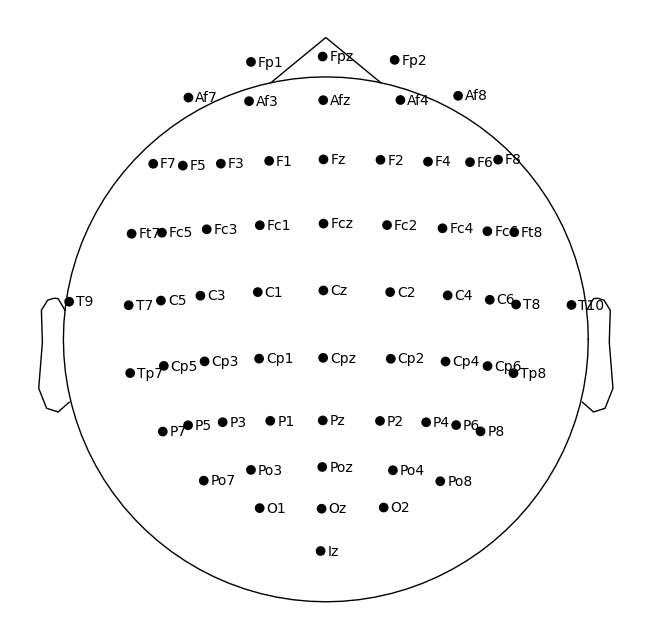
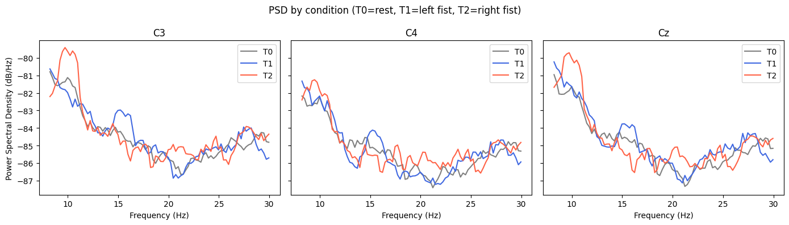
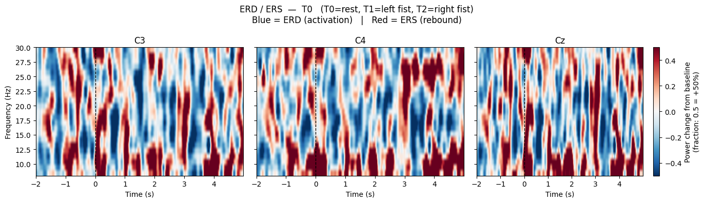
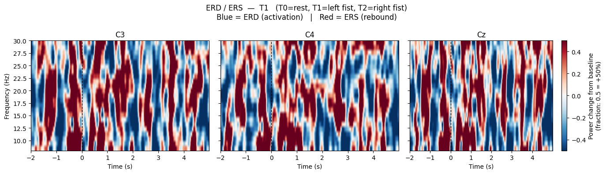
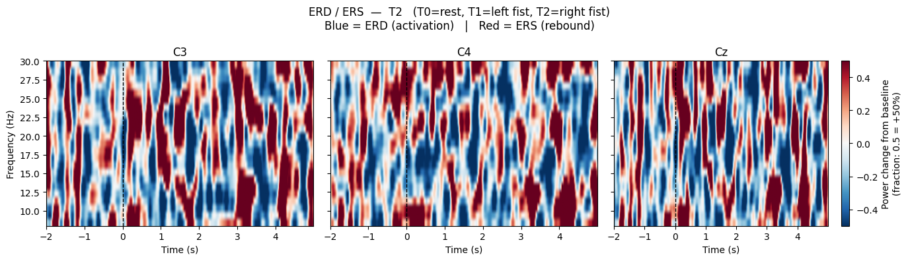
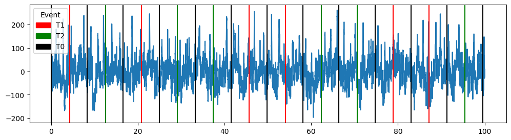

# EEG Motor Imagery Classifier

> Classifying imagined left vs right hand movement from EEG signals using the PhysioNet dataset — with a live Streamlit demo app.

---

## Table of Contents

- [Live Demo](#live-demo)
- [Dataset](#dataset)
- [Channel Selection](#channel-selection)
- [Band Selection](#band-selection)
- [Signal Processing](#signal-processing)
- [Pipeline](#pipeline)
- [Model Results](#model-results)
- [What Was Tried](#what-was-tried)
- [Why Accuracy Stayed Low](#why-accuracy-stayed-low)
- [Findings](#findings)
- [Run Locally](#run-locally)
- [Project Structure](#project-structure)

---

## Live Demo

[](https://eegclassification-e23zmab6w2ai9ocfcsbtv7.streamlit.app/)

<video src="assests/streamlit-app-2026-05-10-09-55-12.webm" controls width="100%"></video>

The app lets you upload any PhysioNet EDF file (runs 4, 8, or 12) or load a built-in demo subject (S029 R04) to visualize signals and run model inference.

---

## Dataset

PhysioNet EEG Motor Movement/Imagery Dataset

| Property | Value |
|---|---|
| Subjects | 109 |
| Channels | 64 |
| Sampling Rate | 160 Hz |
| Trial Length | 4 seconds |
| Runs Used | 4, 8, 12 (imagined fist only) |
| Labels | T0 = rest, T1 = left hand, T2 = right hand |

Runs 4, 8 and 12 are the imagined motor imagery runs. The rest of the runs involve actual movement or feet imagery and were not used. Annotations mark the start of each trial — epochs are cut from that point forward with a 0 to 4 second window.

Out of 109 subjects, only 25 were used for training — those whose per-subject cross-validation accuracy was above 65%. The rest were excluded due to signal noise that the model could not learn from. Different approaches were tried to include more subjects but did not resolve the issue.

---

## Channel Selection

The dataset has 64 channels across the entire scalp. Motor imagery is controlled by the motor cortex which sits along the central strip of the brain.

| Channel | Location | Role |
|---|---|---|
| C3 | Left motor cortex | Activates for right hand imagery (contralateral) |
| C4 | Right motor cortex | Activates for left hand imagery (contralateral) |
| Cz | Central midline | Reference point for lateralization |

Channels were selected by plotting all 64 electrodes on the scalp using the MNE `standard_1005` montage and identifying the three directly over the motor strip. The EDF files store channel names with dots (e.g. `C3.`) which were stripped on load to match the montage.



---

## Band Selection

Two frequency bands were used, both generated by the motor cortex and both known to suppress during motor imagery.

| Band | Range | Phenomenon |
|---|---|---|
| Mu | 8 – 13 Hz | Suppresses (ERD) when motor cortex activates |
| Beta | 13 – 30 Hz | Suppresses during imagery, rebounds after (ERS) |

ERD (Event Related Desynchronization) is the drop in power that occurs when someone imagines moving a limb. The motor cortex goes quiet in these bands rather than becoming more active, which is the detectable signature used for classification.

ERD/ERS analysis was done using Morlet wavelets with a -2s to +5s window around each event onset and a -2s to -0.5s pre-stimulus baseline. PSD was also computed per condition (T0, T1, T2) across C3, C4, Cz to verify that mu and beta bands show separation between rest and imagery.

C3 minus C4 lateralization was plotted to check if left and right imagery produces opposite patterns across the scalp. It did on good subjects but was weak or absent on noisy ones.



ERD / ERS time-frequency maps (Morlet wavelets) — T0, T1, T2





---

## Signal Processing

### Filtering

The raw EEG signal is bandpass filtered to 8–30 Hz to isolate the mu and beta bands. Anything below 8 Hz (delta, theta) and above 30 Hz (gamma, high-frequency noise) is removed. The filter is applied using MNE's FIR firwin design before epoching so the filter sees continuous data, not individual cut segments.

### Event-Based Epochs

The dataset has three annotation types per trial. Only T1 and T2 are used for classification. T0 (rest) is completely dropped.

| Annotation | Meaning | Used |
|---|---|---|
| T0 | Rest / baseline between trials | No — dropped |
| T1 | Left hand motor imagery | Yes — label 0 |
| T2 | Right hand motor imagery | Yes — label 1 |

Each T1 or T2 event marks the onset of a 4-second imagery trial. Epochs are cut from `tmin=0` to `tmax=4` seconds relative to the event onset. No baseline correction is applied since the filter already removes slow drifts and baseline correction was found to have no meaningful effect on band power features.

The original epoch window was set to `tmin=2, tmax=6` to skip the onset transient and focus on steady-state imagery. This caused all epochs to be dropped because the trial is only 4 seconds — the window extended past the trial boundary. The window was corrected to `tmin=0, tmax=4`.

### Feature Extraction — Welch PSD Band Power

For each epoch, Welch's method is used to estimate the power spectral density. Welch divides the signal into overlapping segments, computes the FFT on each, and averages the results to get a stable frequency-domain estimate.

From the PSD, log band power is extracted in two bands for each of the three channels:

| Feature | Channel | Band |
|---|---|---|
| 1 | C3 | Mu (8–13 Hz) |
| 2 | C3 | Beta (13–30 Hz) |
| 3 | C4 | Mu (8–13 Hz) |
| 4 | C4 | Beta (13–30 Hz) |
| 5 | Cz | Mu (8–13 Hz) |
| 6 | Cz | Beta (13–30 Hz) |

This gives 6 features per epoch (3 channels × 2 bands). The log transform compresses the power scale and makes the distribution closer to normal which helps linear classifiers like LDA.

Relative band power (each band divided by total power) was also tried as an alternative normalization but performed worse than absolute log power across all models.

---

## Pipeline

```
Upload EDF  →  Rename Channels  →  Resample to 160 Hz  →  Bandpass Filter (8–30 Hz)
     →  Pick [C3, C4, Cz]  →  Epoch T1/T2 only (tmin=0, tmax=4s)  →  Welch PSD
     →  Log Band Power (mu 8–13 Hz + beta 13–30 Hz)  →  6 Features per Epoch
     →  LDA / SVM / RF / MLP  →  Predict T1 or T2
```



---

## Model Results

### Cross-Subject (25 subjects pooled, StratifiedKFold)

| Model | Accuracy | F1 |
|---|---|---|
| LDA | 0.663 | 0.630 |
| MLP | 0.633 | 0.597 |
| SVM | 0.614 | 0.568 |
| RF | 0.589 | 0.553 |

### Within-Subject (trained and tested on same subject)

| Model | Accuracy | F1 |
|---|---|---|
| LDA | 0.704 | 0.693 |
| MLP | 0.687 | 0.672 |
| SVM | 0.667 | 0.650 |
| RF | 0.670 | 0.657 |

Within-subject numbers are optimistic since the model is evaluated on the same person it trained on. The cross-subject numbers are the realistic estimate of generalization.

Best individual subjects: Subject 72 (0.953 within-subject with MLP), Subject 29 (0.911 with LDA). Most subjects fell between 0.65 and 0.80.

---

## What Was Tried

Epoch window — initially set tmin=2, tmax=6 to avoid the onset transient. This caused all epochs to be dropped because the trial is only 4 seconds long and the window extended past the boundary. Changed to tmin=0, tmax=4.

Per-run processing — tried processing each run (R04, R08, R12) separately instead of concatenating all runs per subject. This avoids concatenation boundary artifacts. Results were similar.

Subject filtering — training on all 89 subjects made the cross-subject model worse. Narrowing to 25 subjects above 65% per-subject accuracy improved cross-subject performance by a few points.

Relative vs absolute band power

| Features | LDA | MLP | SVM | RF |
|---|---|---|---|---|
| Absolute (log power) | 0.663 | 0.633 | 0.614 | 0.589 |
| Relative (normalized) | 0.554 | 0.580 | 0.589 | 0.563 |
| Combined (12 features) | 0.660 | 0.625 | 0.634 | 0.570 |

Absolute features performed best. Combining both did not help.

CSP (Common Spatial Patterns) — standard spatial filter for motor imagery. Tried within-subject but did not get meaningful improvement given the variance across subjects.

GroupKFold vs StratifiedKFold — both were tested. Results were comparable.

None of these approaches got the cross-subject model consistently above 66%.

---

## Why Accuracy Stayed Low

Skull acts as a volume conductor — skull thickness varies significantly between people. A thicker skull dampens and spreads the signal more before it reaches the electrode. Two people imagining the exact same movement can produce very different amplitude readings just because of anatomy.

Electrode impedance variance — contact quality changes between subjects and even between sessions for the same subject. The PhysioNet recordings are research grade but this variance is still present in the data.

Different mental strategies — some people visualize movement visually (seeing the hand move), others do it kinesthetically (feeling the sensation). These strategies activate different neural circuits and produce different frequency patterns. There is no way to control or detect this from the signal alone.

High inter-subject variance — features that separate T1 and T2 well for one subject may be useless for another. The 6 band power features capture average frequency content but miss fine spatial and temporal structure that differs person to person.

Limited spatial resolution — using 3 channels out of 64 throws away most of the spatial information. A full spatial filter over all 64 channels with subject-specific calibration would capture more discriminative patterns but cannot generalize across subjects without per-session fine-tuning.

---

## Findings

LDA is the strongest cross-subject model. Despite being the simplest classifier, LDA consistently outperformed SVM, RF and MLP in the cross-subject setting. Simpler linear decision boundaries generalize better when training data comes from many different individuals with high variance.

Absolute log band power beats relative band power. Normalizing features by total power was expected to remove amplitude variance between subjects but actually hurt performance. LDA dropped from 0.663 to 0.554 when switching to relative features. The absolute log power already carries enough discriminative information and relative normalization removed signal along with noise.

Within-subject accuracy is significantly higher than cross-subject. The best cross-subject result was 0.663 (LDA). The same subjects evaluated within-subject gave 0.704 on average, with top subjects reaching 0.911 (Subject 29) and 0.953 (Subject 72). This gap confirms the problem is not in the features or models — it is in inter-subject variability. A per-person calibration session would make this system meaningfully more accurate.

Subject quality has a large effect on the pooled model. Training on all 89 subjects degraded performance. Narrowing to 25 subjects above 65% per-subject accuracy improved cross-subject results. Noisy subjects introduce conflicting patterns that the model cannot reconcile across individuals.

ERD lateralization is visible but weak on most subjects. The C3 minus C4 difference maps showed the expected flip between T1 and T2 conditions on high-accuracy subjects — C4 drops more for left hand, C3 drops more for right hand. On low-accuracy subjects this pattern was absent or reversed, which explains why those subjects were excluded.

Cross-subject generalization is a fundamental limitation of scalp EEG for motor imagery. The combination of skull anatomy differences, uncontrolled mental strategies, and the limited spatial resolution of 3 channels from a 64-channel setup creates a ceiling for how well a single model can generalize. Getting consistently above 70% cross-subject accuracy with band power features and standard classifiers is unlikely without individual calibration data.

---

## Run Locally

1. Download EEG data (Linux)

```bash
# Edit the subject range in the script first (default 66-90)
bash scripts/download_files.sh
```

Windows — download manually from PhysioNet and place files in `./data/raw/`

2. Train models

```bash
python -m src.model_pipeline.trainmodel
```

Trains LDA, SVM, RF, MLP and saves each as a `.pkl` bundle in `./models/`

3. Run the app

```bash
streamlit run app.py
```

Upload a PhysioNet `.edf` file (runs 4, 8, or 12) or click Load Demo Subject to use S029 R04.

> Note: only subjects with per-subject accuracy above 65% were used for training. See [Model Results](#model-results) for details.

---

## Project Structure

```
ARISE/
├── app.py                          # Streamlit app
├── models/                         # Trained model bundles (.pkl)
│   ├── LDA.pkl
│   ├── SVM.pkl
│   ├── RF.pkl
│   └── MLP.pkl
├── src/
│   ├── preprocessing.py            # EDF loading, filtering, demo loader
│   ├── epochs.py                   # Epoching and PSD per condition
│   ├── plots.py                    # All visualization functions
│   ├── predict.py                  # Inference pipeline
│   └── model_pipeline/
│       ├── data.py                 # Data loading (from file or raw object)
│       ├── preprocessing.py        # Band filter + feature extraction
│       ├── trainmodel.py           # Training script
│       └── splitEvaluate.py        # Cross-validation evaluation
├── notebooks/
│   └── exploration.ipynb           # EDA, band/channel selection, experiments
├── scripts/
│   └── download_files.sh           # Linux download script
└── requirements.txt
```

---

> Full experiment log and findings: [ProgressReport.md](ProgressReport.md)
